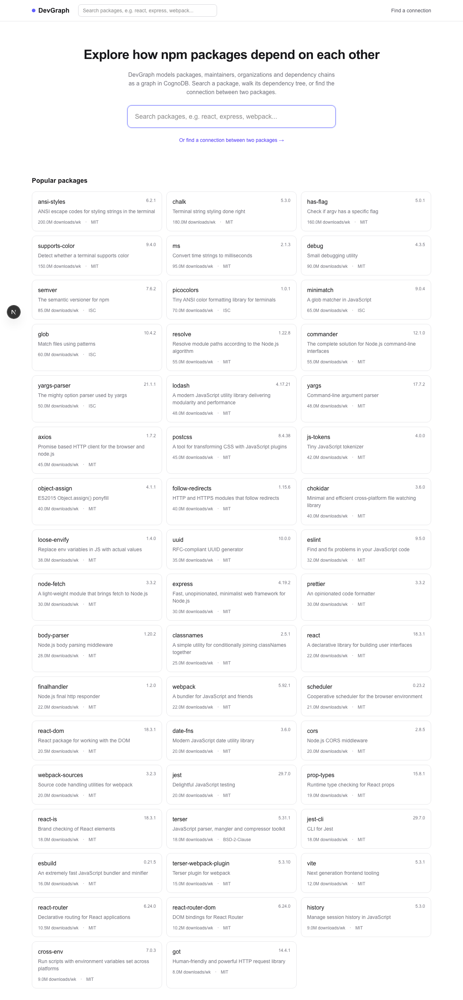
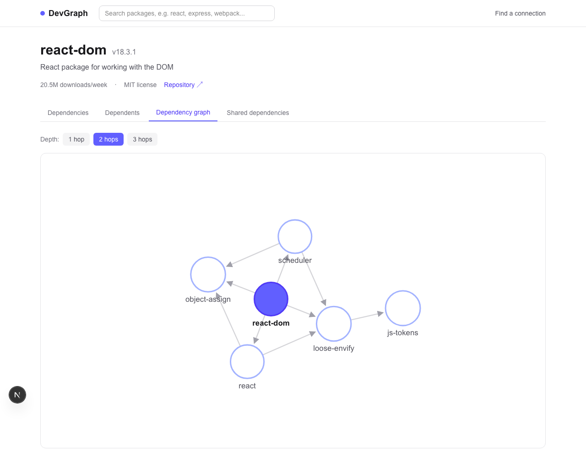
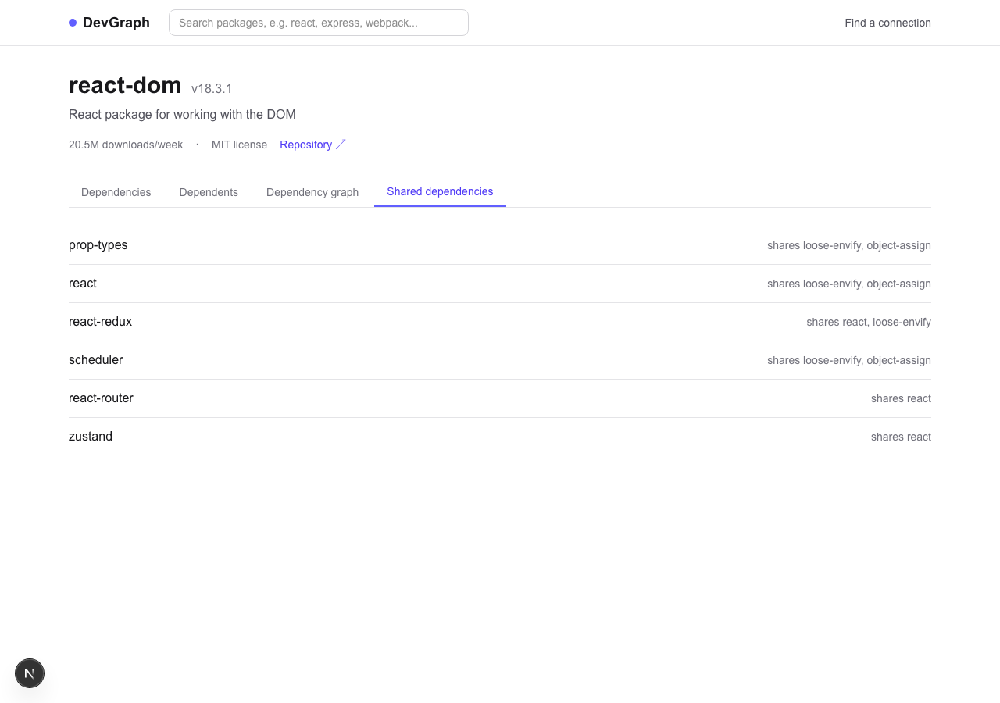
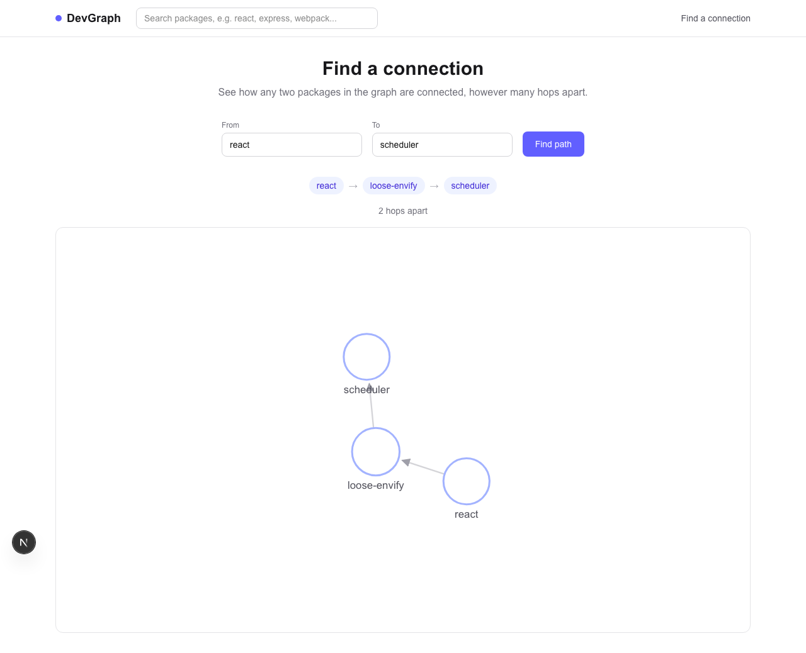

# DevGraph

DevGraph is a graph-based explorer for npm package dependencies. It models packages,
their maintainers, publishing organizations, and categories as a graph in CognoDB, and
lets you search a package, walk its dependency chains, and find the connection between
any two packages — through a small REST API (`apps/api`) and a Next.js frontend
(`apps/web`).

## Screenshots

| | |
| --- | --- |
|  |  |
| Search + browse popular packages | Multi-hop dependency graph (force-directed, click a node to explore it) |
|  |  |
| Packages sharing a dependency | Find a connection between any two packages |

## Why a graph database?

The interesting questions in a package dependency explorer are about connections, not
rows:

- **"What breaks if I upgrade X?"** requires walking `DEPENDS_ON` outward an unknown
  number of hops. In SQL this is a self-join per hop, or a recursive CTE with manual
  cycle detection. In Cypher it's `-[:DEPENDS_ON*1..3]->` — the traversal depth is a
  parameter of the pattern, not a structural change to the query.
- **"Is there any relationship between package A and package B?"** (`/api/graph/path`)
  is a variable-length, direction-agnostic shortest-path search. There's no fixed number
  of joins that answers this in a relational schema — you'd need the same kind of
  recursive traversal, and it gets worse if you don't already know how many hops apart
  the two packages are.
- **"Which packages share a dependency with X?"** (`/api/packages/:name/shared-dependencies`)
  is a single `MATCH (a)-[:DEPENDS_ON]->(dep)<-[:DEPENDS_ON]-(b)` pattern — a triangle
  through a shared neighbor. The relational equivalent is a self-join of the dependency
  edge table against itself on the shared foreign key, which works for one hop but stops
  reading like the question you actually asked as soon as "shared dependency" needs to
  mean "shared dependency of a dependency."

None of this data is tabular in spirit — packages, maintainers, orgs, and categories are
naturally a graph, and the interesting queries are all about the shape of the
connections between them, not about aggregating rows.

## Architecture

**Backend:**

```text
Route → Controller → Service → db/query.ts (runQuery) → CognoDB (Bolt / openCypher)
```

- **Routes** (`src/routes`) wire URLs to controllers and attach validation middleware.
- **Controllers** (`src/controllers`) handle HTTP concerns only: read the validated
  input, call a service, shape the response.
- **Services** (`src/services`) hold the actual Cypher queries and application logic.
- **`src/db/driver.ts`** creates a single shared `neo4j-driver` instance from env vars.
- **`src/db/query.ts`** is a small helper (`runQuery`) that opens a session, runs a
  parameterized query, and always closes the session — every service goes through it.
- **`src/middleware/errorHandler.ts`** is the single place that turns thrown errors
  (validation errors, "not found" errors, database errors) into the right HTTP status
  and a safe JSON body.

**Frontend** (`apps/web`, Next.js App Router + Tailwind):

- **`lib/api.ts`** is the one place that talks to the backend — every request goes
  through `apiFetch`, which normalizes both HTTP errors and network failures into a
  single `ApiError`, so every page/component handles failure the same way.
- Package detail (`app/packages/[name]/page.tsx`) is a **server component** — it fetches
  the package server-side and calls `notFound()` on a 404, so a bad URL renders a proper
  404 page instead of a client-side error flash.
- The four tabs (dependencies, dependents, graph, shared) are **client components**
  that lazily fetch their own data through a shared `useAsync` hook, so switching tabs
  doesn't block on data the user hasn't asked to see yet.
- **`DependencyGraph.tsx`** renders the graph as plain SVG, laid out with `d3-force`
  (no prebuilt graph-visualization library) — nodes are packages sized by downloads,
  edges are arrows, clicking a node navigates to that package.

```text
devgraph/
├── apps/
│   ├── api/              Express + TypeScript backend
│   │   ├── src/
│   │   │   ├── config/       env loading + validation
│   │   │   ├── db/            driver + query helper
│   │   │   ├── controllers/   HTTP request/response handling
│   │   │   ├── services/      Cypher queries + application logic
│   │   │   ├── routes/        route → controller wiring
│   │   │   ├── validators/    Zod schemas
│   │   │   ├── middleware/    validation + centralized error handling
│   │   │   └── types/         shared TypeScript types
│   │   └── tests/             Vitest + Supertest tests
│   └── web/               Next.js frontend
│       └── src/
│           ├── app/           routes (/, /packages/[name], /path)
│           ├── components/    tabs, graph visualization, search, shared states
│           ├── lib/            API client, useAsync hook, formatting
│           └── types/          shared TypeScript types (mirrors the API)
├── database/seed/         standalone seed script for CognoDB
└── docs/screenshots/
```

## Graph model

```text
(:Package)-[:DEPENDS_ON]->(:Package)
(:Package)-[:MAINTAINED_BY]->(:Developer)
(:Package)-[:PUBLISHED_BY]->(:Organization)
(:Package)-[:BELONGS_TO]->(:Category)
```

Example chain demonstrating multi-hop traversal:

```text
react-dom --DEPENDS_ON--> react --DEPENDS_ON--> loose-envify --DEPENDS_ON--> js-tokens
```

Node properties:

| Label          | Properties                                                  |
| -------------- | ------------------------------------------------------------ |
| `Package`      | `name`, `version`, `description`, `license`, `downloads`, `repository` |
| `Developer`    | `name`, `github` (unique key)                                |
| `Organization` | `name` (unique key), `website`                               |
| `Category`     | `name` (unique key)                                           |

Uniqueness constraints are created on `Package.name`, `Developer.github`,
`Organization.name`, and `Category.name` so the seed script's `MERGE` calls are safe
and repeatable.

## Environment variables

`apps/api/.env` (see `apps/api/.env.example`):

```env
PORT=5000
COGNODB_URI=bolt://localhost:7687
COGNODB_USERNAME=cognodb
COGNODB_PASSWORD=
```

`database/.env` (see `database/.env.example`) needs the same three `COGNODB_*` values
so the seed script can connect independently of the API.

`apps/web/.env.local` (see `apps/web/.env.local.example`):

```env
NEXT_PUBLIC_API_URL=http://localhost:5000
```

The frontend never talks to CognoDB directly — it only knows the API's URL. No database
credentials exist anywhere in the frontend.

Credentials are never hard-coded — both the API and the seed script fail fast with a
clear error if the required variables are missing.

> **macOS note:** port `5000` is also used by the AirPlay Receiver on modern macOS, which
> will silently intercept requests and return a `403` from `AirTunes` instead of your
> server. If you see that while testing locally, either turn off AirPlay Receiver
> (System Settings → General → AirDrop & Handoff) or run with `PORT=5050` locally.

## Local setup

```bash
npm install                 # installs all three workspaces (apps/api, apps/web, database)
cp apps/api/.env.example apps/api/.env
cp database/.env.example database/.env
cp apps/web/.env.local.example apps/web/.env.local
# fill in COGNODB_URI / COGNODB_USERNAME / COGNODB_PASSWORD in both .env files

npm run seed                # populate CognoDB
npm run dev:api             # http://localhost:5000 (see macOS note above)
npm run dev:web             # http://localhost:3000, in a second terminal
```

## CognoDB setup

Point `COGNODB_URI` at any CognoDB instance reachable over Bolt (local, Docker, or
hosted). The driver connects with `neo4j.auth.basic(username, password)` — no
credentials are ever embedded in the connection URI itself.

## Seed data

```bash
npm run seed
```

Seeds ~63 real npm packages (react, express, webpack, vite, jest, etc.) across 10
categories, 10 fictional developer maintainers, and 5 fictional publishing
organizations, connected by 100+ `DEPENDS_ON` relationships with realistic dependency
chains. The script uses `MERGE`, so running it repeatedly does not create duplicates.

Package names are real for realism; maintainers and organizations are fictional
personas, since the seed data shouldn't assert real employment or ownership facts about
actual people or companies.

## API endpoints

All responses are wrapped as `{ "data": ... }` on success or `{ "error": { "message": "..." } }`
on failure.

| Method | Path                                          | Description                              |
| ------ | ---------------------------------------------- | ----------------------------------------- |
| GET    | `/health`                                      | Checks CognoDB connectivity               |
| GET    | `/api/packages?search=`                        | List/search packages (for discovery/autocomplete) |
| GET    | `/api/packages/:name`                          | Package details                           |
| GET    | `/api/packages/:name/dependencies`             | Direct `DEPENDS_ON` targets               |
| GET    | `/api/packages/:name/dependents`                | Packages that depend on this one          |
| GET    | `/api/packages/:name/graph?depth=1\|2\|3`      | Multi-hop dependency graph (nodes + edges) |
| GET    | `/api/packages/:name/shared-dependencies`      | Packages sharing at least one dependency  |
| GET    | `/api/graph/path?from=X&to=Y`                  | Shortest connection between two packages  |

### Example requests

```bash
curl http://localhost:5000/api/packages/react
curl http://localhost:5000/api/packages/react-dom/dependencies
curl http://localhost:5000/api/packages/loose-envify/dependents
curl "http://localhost:5000/api/packages/react-dom/graph?depth=2"
curl "http://localhost:5000/api/graph/path?from=react&to=scheduler"
curl http://localhost:5000/api/packages/axios/shared-dependencies
```

### Main queries explained

**Multi-hop dependency graph** (`packageService`/`graphService`, `graph.ts`) — walks
1–3 hops out from a package and returns the distinct nodes and edges touched, so a
frontend can render it directly:

```cypher
MATCH path = (root:Package {name: $name})-[:DEPENDS_ON*1..3]->(:Package)
UNWIND relationships(path) AS rel
WITH DISTINCT startNode(rel) AS from, endNode(rel) AS to
RETURN from, to
```

**Path finding** (`graphService.findPath`) — treats `DEPENDS_ON` as undirected so it
finds *any* connection between two packages, not just a direct dependency chain in one
direction:

```cypher
MATCH (a:Package {name: $from}), (b:Package {name: $to})
MATCH path = shortestPath((a)-[:DEPENDS_ON*1..6]-(b))
RETURN path
```

**Shared dependencies** (`packageService.getSharedDependencies`) — the query a
relational schema finds awkward: find every other package that depends on at least one
of the same things this package does, via a single triangle pattern:

```cypher
MATCH (:Package {name: $name})-[:DEPENDS_ON]->(dep:Package)<-[:DEPENDS_ON]-(other:Package)
WHERE other.name <> $name
RETURN other, collect(DISTINCT dep.name) AS shared
ORDER BY size(shared) DESC, other.name
```

### Errors

| Status | Meaning                                    |
| ------ | -------------------------------------------- |
| 400    | Invalid input (bad package name, bad depth) |
| 404    | Package or path not found                   |
| 500    | Unexpected server error                     |
| 503    | CognoDB unreachable                          |

Raw CognoDB/Neo4j errors are never sent to the client — they're logged server-side and
mapped to one of the statuses above.

## Testing

```bash
npm test
```

16 Vitest + Supertest tests run against the live CognoDB instance (via the exported
Express `app`, no real port bound): health check, package lookup (found/missing),
dependencies, dependents, the multi-hop graph endpoint (default depth, valid depth,
invalid depth), path finding (found/missing), shared dependencies, validation failures,
and the catch-all 404 handler.

## Production build

```bash
npm run build                # builds both apps/api (tsc) and apps/web (next build)
npm run start                # node apps/api/dist/server.js
npm run start -w apps/web    # next start, separately
```

## Deployment

Deploy the two apps independently:

- **API** (`apps/api`) — any Node host (Render, Railway, Fly.io). Set `COGNODB_URI`,
  `COGNODB_USERNAME`, `COGNODB_PASSWORD`, and `PORT` as environment variables on the
  host; build with `npm run build -w apps/api`, start with `npm run start -w apps/api`.
- **Web** (`apps/web`) — Vercel is the path of least resistance for a Next.js app. Set
  `NEXT_PUBLIC_API_URL` to the deployed API's URL as a build-time environment variable.

Once both are deployed, `NEXT_PUBLIC_API_URL` on the frontend host must point at the
live API URL (not `localhost`).

## Important engineering decisions

- **`app.ts` vs `server.ts`**: the Express app is built and exported from `app.ts`;
  `server.ts` just calls `app.listen()`. This lets tests exercise the app in-process via
  Supertest without binding a real port.
- **`depth` is interpolated, not parameterized**: Cypher does not support parameterizing
  variable-length relationship bounds (`*1..$depth` is not valid). Since `depth` is
  already restricted by Zod to the literal values `1`, `2`, or `3` before it reaches the
  query, interpolating it is safe — it's never raw user input.
- **`disableLosslessIntegers: true`** on the driver so download counts and hop counts
  come back as plain JS numbers instead of Neo4j's `Integer` wrapper type. Safe here
  since none of our values approach the 2^53 precision boundary.
- **Path finding treats `DEPENDS_ON` as undirected** (`shortestPath((a)-[:DEPENDS_ON*1..6]-(b))`)
  so "find a connection" can surface a useful relationship between two packages
  regardless of which one depends on the other — this is the assignment's relational
  advantage case: expressing this with a hop-bounded, direction-agnostic traversal is
  awkward to express as SQL joins.
- **Existence checks before relationship queries**: `getDependencies`/`getDependents`/etc.
  first look the package up (throwing a 404 if missing) and then run the relationship
  query. Two small queries instead of one `OPTIONAL MATCH` query, traded for clarity.
- **The force-directed layout is computed with `useMemo`, not `useEffect` + a ref**: an
  earlier version ran the `d3-force` simulation in an effect and stashed the result in a
  ref, forcing a re-render manually. That reads a ref during render, which React
  considers unsafe (the value can go stale without triggering an update). Since the
  layout is a pure function of the `graph` prop — no async step, nothing external to
  synchronize with — computing it directly in `useMemo` is both simpler and correct.
- **`useAsync` and `apiFetch`/`ApiError`** exist so every client component's data
  fetching (loading/error/success) is the same three lines, and every failure — a 404, a
  validation error, or the API being completely unreachable — surfaces as the same typed
  `ApiError` a component can render an `ErrorState` from.
- **`PathFinder` reads `useSearchParams()`**, so a search is reflected in the URL
  (`/path?from=react&to=scheduler`) and is shareable/bookmarkable. Next.js requires that
  wrapped in a `<Suspense>` boundary, which is why `app/path/page.tsx` is a thin
  server-component wrapper around the actual client component.
